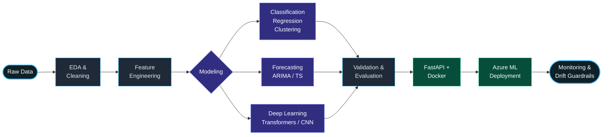
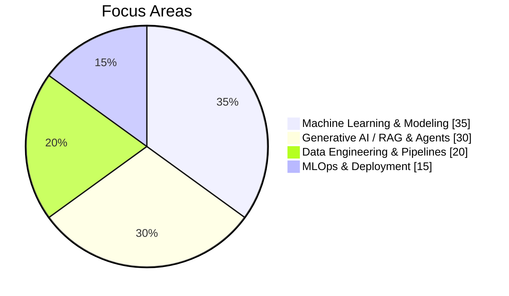
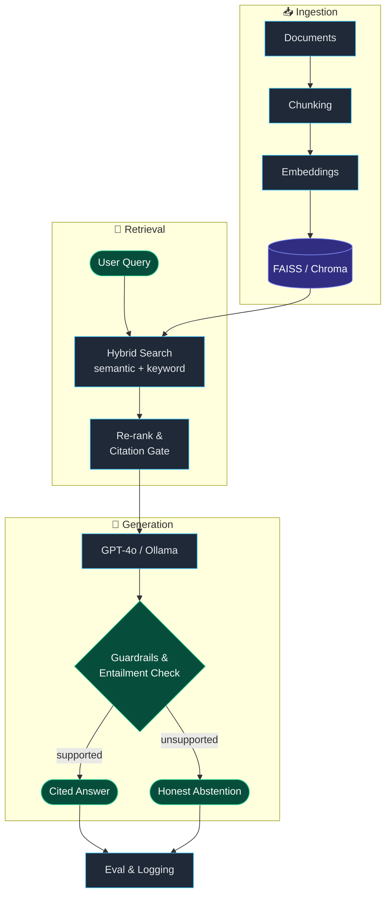

<!-- ═══════════════════════════════ HEADER ═══════════════════════════════ -->

<div align="center">


<a href="https://github.com/hammadfarooq-ai">
  
</a>

<br/>

<!-- ─────────────── SOCIAL BADGES ─────────────── -->
<p>
  <a href="https://www.linkedin.com/in/hammadfarooq-ai/"></a>
  <a href="https://www.kaggle.com/malikhammadfarooq"></a>
  <a href="https://medium.com/@hammad-farooq"></a>
  <a href="https://www.youtube.com/@Guidinglight-2747"></a>
  <a href="https://x.com/HammadFarooq470"></a>
  <a href="mailto:hammadfarooq470@gmail.com"></a>
</p>

<p>
  
  
  
  
</p>

</div>


<!-- ═══════════════════════════════ AT A GLANCE ═══════════════════════════════ -->

<div align="center">

<table>
<tr>
<td align="center" width="20%">
  <br/>
  <b>2x</b><br/><sub>Kaggle Grandmaster</sub>
</td>
<td align="center" width="20%">
  <br/>
  <b>#15</b><br/><sub>Global Rank</sub>
</td>
<td align="center" width="20%">
  <br/>
  <b>620+</b><br/><sub>Notebooks</sub>
</td>
<td align="center" width="20%">
  <br/>
  <b>154+</b><br/><sub>Datasets</sub>
</td>
<td align="center" width="20%">
  <br/>
  <b>5+ yrs</b><br/><sub>Experience</sub>
</td>
</tr>
</table>

</div>

---

<!-- ═══════════════════════════════ ABOUT ═══════════════════════════════ -->

##  &nbsp;About Me


```python
class HammadFarooq:
    def __init__(self):
        self.role       = "Data Scientist & AI Developer"
        self.experience = "5+ years"
        self.focus      = ["Predictive Analytics",
                           "Machine Learning",
                           "LLM / RAG Systems"]
        self.domains    = ["Finance", "Real Estate",
                           "Legal-Tech", "Healthcare", "BI"]
        self.rank       = "2x Kaggle Grandmaster (#15 Global)"

    def what_i_do(self):
        return ("EDA -> Feature Engineering -> Modeling -> "
                "Validation -> Deployment -> Monitoring")
```

> **Data Scientist with 5+ years** of experience building, deploying, and monitoring machine learning
> models — classification, regression, clustering, and time-series forecasting — for clients across
> finance, real estate, legal-tech, healthcare, and enterprise business intelligence.

- 🔭 &nbsp;Building **multi-agent LLM platforms** and **production ML pipelines**
- 🏆 &nbsp;**2x Kaggle Grandmaster** — ranked **#15 globally** in both *Datasets* and *Notebooks*
- 📈 &nbsp;**620+** public notebooks · **154+** datasets · fully reproducible experiment repositories
- 🎓 &nbsp;Invited speaker, **AI Technologies Summer School 2026** (Ivan Franko National University, Ukraine)
- 🎥 &nbsp;Sharing insights on [**YouTube**](https://www.youtube.com/@Guidinglight-2747) and [**Medium**](https://medium.com/@hammad-farooq)
- 💬 &nbsp;Ask me about **ML pipelines, RAG architectures, forecasting, and MLOps on Azure**

<br clear="right"/>

---

<!-- ═══════════════════════════════ WORKFLOW DIAGRAM ═══════════════════════════════ -->

##  &nbsp;How I Build ML Systems



<div align="center">

| Stage | What I Actually Do |
|:--|:--|
| 🔍 **Explore** | Statistical EDA, hypothesis & A/B testing, data quality auditing |
| 🧱 **Engineer** | Feature design, encoding, scaling, leakage checks, PySpark pipelines |
| 🧠 **Model** | Random Forest, Gradient Boosting, ARIMA, CNN, transfer learning, fine-tuning |
| 📏 **Validate** | Cross-validation, metric selection, error analysis, calibration |
| 🚀 **Ship** | FastAPI services, Docker images, CI/CD on GitHub, Azure ML |
| 📡 **Monitor** | Drift detection, prediction-quality checks, safety guardrails |

</div>

---

<!-- ═══════════════════════════════ TECH STACK ═══════════════════════════════ -->

##  &nbsp;Tech Stack

<div align="center">

<a href="https://skillicons.dev">
  
</a>

<br/><br/>

#### 🧠 &nbsp;Languages & Data


#### 📊 &nbsp;Analysis & Visualization


#### 🤖 &nbsp;Machine Learning & Deep Learning


#### 🧬 &nbsp;Generative AI & LLM Engineering


#### ⚙️ &nbsp;Backend, Cloud & MLOps


#### 🔗 &nbsp;Automation & Tooling


</div>

---

<!-- ═══════════════════════════════ FOCUS SPLIT ═══════════════════════════════ -->

##  &nbsp;Where I Spend My Time

<table>
<tr>
<td width="50%" valign="top">



</td>
<td width="50%" valign="top">

<br/>


</td>
</tr>
</table>

---

<!-- ═══════════════════════════════ RAG ARCHITECTURE ═══════════════════════════════ -->

##  &nbsp;A RAG System I Ship



---

<!-- ═══════════════════════════════ STATS ═══════════════════════════════ -->

##  &nbsp;GitHub Analytics

<div align="center">


</div>

---

<!-- ═══════════════════════════════ ACHIEVEMENTS ═══════════════════════════════ -->

##  &nbsp;Achievements & Recognition

<div align="center">

| 🏅 | Achievement |
|:--:|:---|
| 🥇 | **2x Kaggle Grandmaster** — Datasets **#15** and Notebooks **#15** globally |
| 📚 | **620+** public notebooks and **154+** datasets, thousands of views across the community |
| 🧠 | **32nd / 2,673 teams** — Akkadian Translation competition (fine-tuned ByT5) |
| 🎤 | Invited speaker, **AI Technologies Summer School 2026** — Ivan Franko National University, Ukraine<br/>*70 speakers · 21 countries · 1,335 participants · Certificate of Gratitude* |
| 🚀 | **LabLab.ai Hackathon** competitor — shipped working ML solutions under real-world constraints |
| 🧪 | Global research challenges — **ARC-AGI**, Legal Information Retrieval, **NVIDIA** reasoning benchmarks |

</div>

---

<!-- ═══════════════════════════════ CERTIFICATIONS ═══════════════════════════════ -->

##  &nbsp;Certifications & Education

<div align="center">

<a href="https://www.coursera.org/account/accomplishments/professional-cert/YH09IVR227K0"></a>
<a href="https://www.coursera.org/"></a>
<a href="https://www.coursera.org/account/accomplishments/professional-cert/QFL9NO24AM7X"></a>
<a href="https://www.coursera.org/account/accomplishments/specialization/AXVDK22Y3XT4"></a>
<a href="https://www.coursera.org/"></a>


<br/><br/>

<table>
<tr>
<td align="center" width="50%">
  <br/>
  <b>BS in Data Science</b><br/>
  <sub>Virtual University of Pakistan</sub>
</td>
<td align="center" width="50%">
  <br/>
  <b>ICS — Computer Science</b><br/>
  <sub>Punjab Group of Colleges</sub>
</td>
</tr>
</table>

</div>

---

<!-- ═══════════════════════════════ CONTACT ═══════════════════════════════ -->

##  &nbsp;Let's Build Something

<div align="center">

**Open to data science, machine learning and AI engineering roles — remote or relocation.**

<a href="mailto:hammadfarooq470@gmail.com"></a>
<a href="https://www.linkedin.com/in/hammadfarooq-ai/"></a>
<a href="https://www.kaggle.com/malikhammadfarooq"></a>

<br/><br/>


<br/>

> *"Data is the raw material — the value is in the decision it enables."*

<br/>

⭐️ &nbsp;From [**@hammadfarooq-ai**](https://github.com/hammadfarooq-ai) — thanks for stopping by!

</div>


